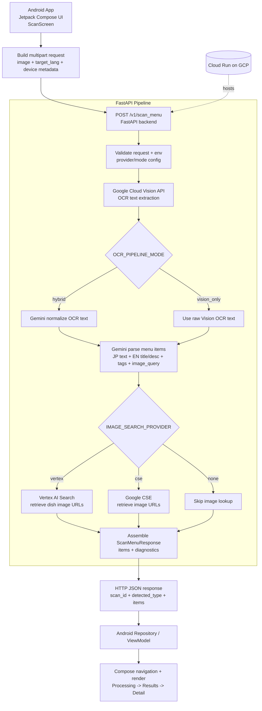

# MenuLens Request Flow (1-Page)

This diagram shows the end-to-end runtime flow from Android capture to backend processing and back to app rendering.

## Notes

- Android sends the captured menu image as multipart form data to `v1/scan_menu`.
- FastAPI orchestrates OCR, optional normalization, parsing, and optional image search.
- Provider selection controls image lookup strategy (`none | cse | vertex`).
- The final JSON response is displayed in Android `Results` and `Detail` screens.
